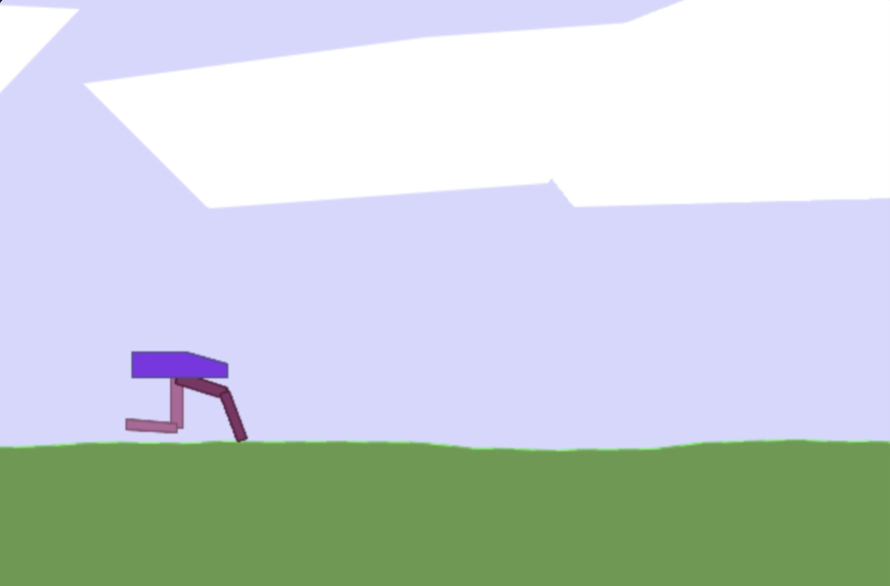
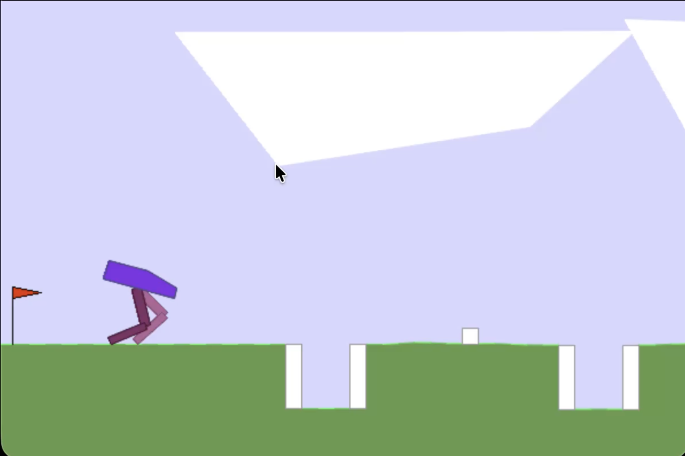

# AISF Submission

------------------------------------------------
1\. Description and Goal of the Project
------------------------------------------------
The primary goal of this project is to train a Bipedal Walker to be able to walk a short distance to the right. To make it harder, obstacles and holes may be added to increase the difficulty. This uses Reinforcment Learning (RL) and a Proximal Policy Optimization (PPO) to train the walker. The algorithm is implemente with a custom reward function and the stable-baselines3 library in Python.

------------------------------------------------
2\. Directory Tree
------------------------------------------------

```
├── FinalRecordings
│   ├── Hardcore
│   │   ├── best_reach_end.mov
│   │   ├── fail_hole.mov
│   │   ├── hardcore_fail.mov
│   │   ├── knee.mov
│   │   ├── lidar.mov
│   │   └── nolift.mov
│   └── Normal
│       └── easy_mode.mov
├── README.md
└── src
    ├── Hardcore
    │   ├── hardcode_tuning_knee.py
    │   ├── hardcode_tuning_knee_eval.py
    │   ├── hardcode_tuning_lidar.py
    │   ├── hardcode_tuning_lidar_eval.py
    │   ├── hardcode_tuning_nolift.py
    │   ├── hardcode_tuning_nolift_eval.py
    │   ├── hardcore_fail.py
    │   ├── hardcore_tuning4.py
    │   └── hardcore_tuning4_eval.py
    └── Normal
        ├── bipedal.gif
        ├── bipedal.py
        ├── bipedal_tuning1.gif
        ├── bipedal_tuning1.py
        └── tempCodeRunnerFile.py
```

------------------------------------------------
3\. Features & Reward Design
------------------------------------------------

The first thing that I did was create a PPO algorithm for the Normal difficulty Bipedal Walker environment. There were no obstacles so the walker just had to learn how to walk without falling. This didn't require extensive training or any reward functions at all. I just used a standard stable-baselines3 PPO that I one-shot from Gemini 3.

After solving the easy mode and changing the environment to the hardcore environment, my walker starting falling right away. I then did many modifications to tune my walker, but the
1) entropy coefficient: After increasing the entropy coefficient, it started exploring more than it used to
2) gamma: I increased the gamma value, which would makes the walker consider the future very heavily, albeit at a slightly discounted weight
3) gae lambda: I increased the gae lambda value, which makes it prioritize more long-term strategies instead of just the short term
4) total timesteps: This simply allowed the walker to train for much longer periods of time



Eventually, the walker started walking. However, it would not be able to pass holes or walls consistently. Therefore, I started rewarding the walker if it was able to succesfully traverse holes or obstacles after previously detecting it with its LIDAR. After training the walker for millions of time steps, the walker could now consistently clear holes and lower level obstacles.



------------------------------------------------
4\. Ablation studies
------------------------------------------------

I conducted ablation studies to compare the impact of each change. It appears that the changes to rewarding successful use of the LIDAR to bypass obstacles was a significantly important step in the walker's abilities. However, the walker may still be moving too fast and sometimes gets its legs stuck on larger obstacles or cannot react to a hole in time. Additionally, the walker gained the habit of raising its legs even on flat terrain which lowers its overall stability. Therefore, these would be something that I would continue to work on if I had more time.